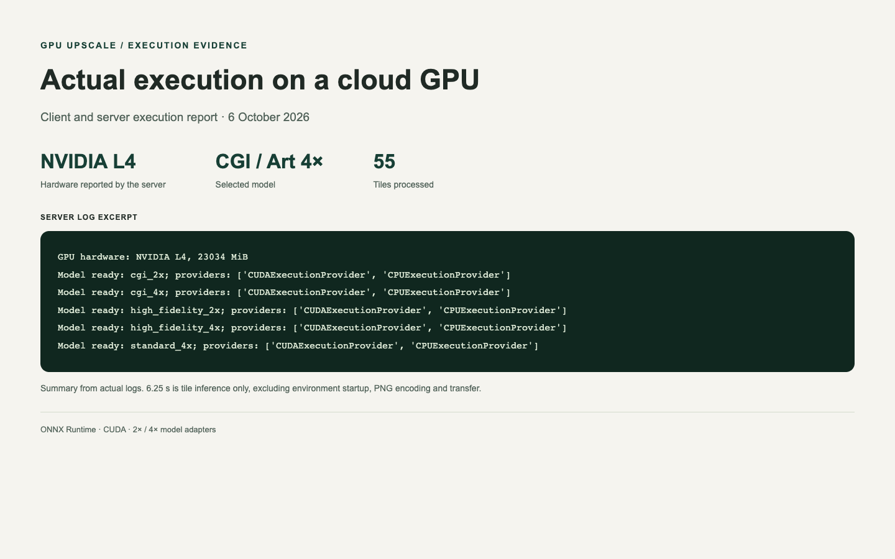
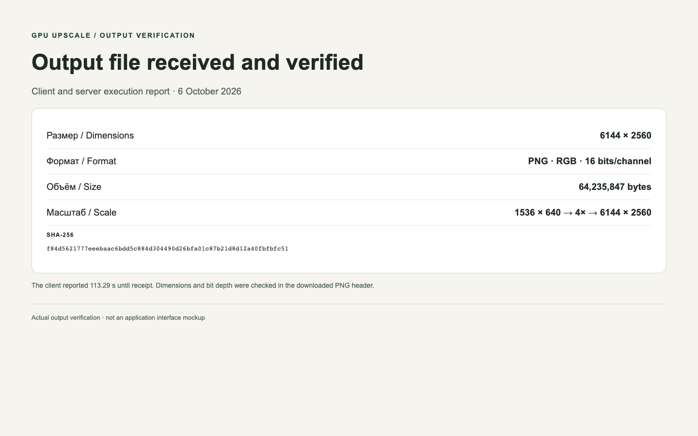

# Batch GPU Image Upscaler

A local batch client and cloud GPU worker for ONNX super-resolution models. Submit a folder once, process images sequentially on NVIDIA L4, blend overlapping tiles and save 8- or 16-bit RGB PNG files.

[Portfolio case](https://evgeny-meleshkevich.github.io/work/cloud-gpu-upscale/?lang=en) · [Русский](README.ru.md)

## What is implemented

- ONNX model adapters for CGI/Art 2×/4×, High Fidelity 2×/4× and Standard 4×.
- FP16 tensor inputs, noise/sharpness/compression controls and 128/192-pixel tiles.
- Weighted linear overlap blending and padding/cropping at image boundaries.
- A CUDA container, NVIDIA L4 configuration and persistent model volume on Modal.
- Folder processing, manual parameters and optional local CoreML parameter estimation.
- A macOS folder picker and a local `--inspect` mode that makes no cloud calls.

The neural models are third-party Topaz models, not trained by the portfolio author. This repository contains the application code only: no weights, model extraction/decryption keys or automatic vendor downloads. Supply compatible models you are authorised to use and review their terms before deployment.

## Setup

Python 3.11+. Create a virtual environment and run `pip install -r requirements.txt`, then `modal setup` to authenticate your own account.

To inspect inputs without uploading them or allocating GPU resources:

```bash
python upscale.py /path/to/images --model cgi --scale 4 --bit-depth 16 --inspect
```

For cloud execution, create the `gpu-upscale-models` volume and upload authorised compatible ONNX files under `models/` using `modal volume create gpu-upscale-models` and `modal volume put gpu-upscale-models /path/to/models /models`. Exact expected filenames and tensor interfaces are in `TOPAZ_MODELS` in `app.py`. You only need the model variant you select.

```bash
python upscale.py /path/to/images --model cgi --scale 4 --bit-depth 16 \
  --denoise 0.05 --sharpen 0.45 --compression 0.0
```

Or double-click `run.command` on macOS. GPU calls use your provider account and may incur charges. Results are saved in a subfolder alongside the input files. Start with a small batch. Files with matching output names can be overwritten; retain your originals. Processing errors stop the current run; durable retries/resume are not implemented.

## Source map

- `app.py`: cloud environment, model availability, sessions, tile inference and PNG encoding.
- `upscale.py`: file collection, options, sequential remote calls and output saving.
- `autopilot.py`: optional CoreML parameter estimator; model files are excluded. It is not a file watcher.
- `run.command`: macOS folder picker.
- `test_local.py`: local checks of assembly, PNG output and model selection. These tests do not execute neural networks or allocate GPUs.

## Actual cloud run: 6 October 2026

A real run of this client completed with the CGI/Art 4× model. The server reported NVIDIA L4 (23034 MiB), loaded five model variants with CUDAExecutionProvider and processed 55 tiles. Tile inference took 6.25 s; the client call until receiving the file took 113.29 s, including worker preparation, inference, PNG encoding and transfer. These are one-run measurements, not general performance guarantees.

The downloaded output was independently verified: 6144×2560 RGB PNG, 16 bits per channel, 64,235,847 bytes. The source was 1536×640. [Machine-readable verification](docs/live-verification.json). The portfolio comparison and downloadable master now use this new output.




These screenshots present reports compiled from actual client/server logs and file inspection, not a graphical application interface. Full logs remain private to exclude account details.

To reuse an existing authorised model volume, set `UPSCALE_MODEL_VOLUME` to its name before starting the client. Otherwise the default is `gpu-upscale-models`.

The public package is adapted from the existing service: model download/decryption is replaced by supplied-file validation, incorrect model fallback is rejected, automatic estimation is opt-in, and billing/shutdown guarantees are removed. The original service remains separate.

Run local checks with `pip install opencv-python-headless` followed by `python -m unittest test_local.py`. Optional CoreML estimation requires `coremltools` and compatible authorised local models. Defaults are used when those models are unavailable.
