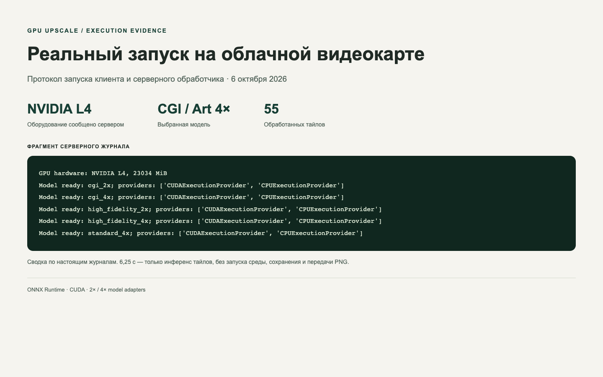
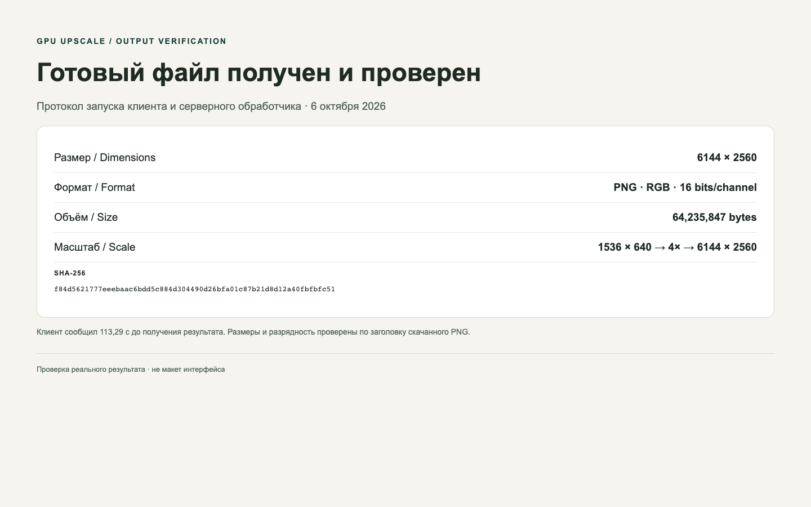

# Пакетный GPU-апскейлер изображений

Локальный клиент и облачный обработчик ONNX-моделей суперразрешения. Один запуск для папки: последовательная отправка файлов на NVIDIA L4, обработка перекрывающимися тайлами и сохранение RGB PNG с 8 или 16 битами на канал.

[Кейс портфолио](https://evgeny-meleshkevich.github.io/work/cloud-gpu-upscale/?lang=ru) · [English](README.md)

## Устройство

`app.py` задаёт CUDA-контейнер, L4, постоянный том моделей, ONNX-сессии, тайлинг и сборку PNG. `upscale.py` собирает файлы, передаёт параметры и сохраняет результат. `autopilot.py` — дополнительный локальный оценщик параметров CoreML, а не наблюдение за папкой. `run.command` открывает выбор папки на macOS.

Поддержаны интерфейсы CGI/Art 2×/4×, High Fidelity 2×/4× и Standard 4×, FP16, настройка шума, резкости и сжатия. Тайлы 128/192 пикселя соединяются линейными весами в областях перекрытия. Модели сторонние, их обучение не является работой автора.

## Запуск

Python 3.11+, виртуальное окружение, `pip install -r requirements.txt`, авторизация собственного аккаунта через `modal setup`.

Локальная проверка списка файлов без облачных вызовов:

```bash
python upscale.py /путь/к/изображениям --model cgi --scale 4 --bit-depth 16 --inspect
```

Для обработки нужны совместимые модели, которые вы вправе использовать. Веса, ключи распаковки и автоматическая загрузка моделей из CDN не публикуются. Создайте том `modal volume create gpu-upscale-models`, загрузите файлы командой `modal volume put gpu-upscale-models /путь/к/моделям /models`. Имена файлов и входов указаны в `TOPAZ_MODELS` в `app.py`; достаточно выбранного варианта модели.

```bash
python upscale.py /путь/к/изображениям --model cgi --scale 4 --bit-depth 16 \
  --denoise 0.05 --sharpen 0.45 --compression 0.0
```

Облачные вызовы используют ваш аккаунт и могут быть платными. Результаты сохраняются рядом с исходной папкой. Совпадающие имена результатов могут перезаписываться; сохраняйте оригиналы. Ошибка обработки останавливает запуск; автоматические повторы и возобновление не реализованы. На macOS можно открыть `run.command`. Опциональный `--auto` требует CoreML-моделей и `coremltools`; при отсутствии моделей используются значения по умолчанию.

## Что проверено

6 октября 2026 выполнен настоящий облачный запуск этого клиента с CGI/Art 4×. Сервер сообщил NVIDIA L4 (23034 MiB), загрузил пять вариантов моделей с CUDAExecutionProvider и обработал 55 тайлов. Инференс занял 6,25 с; клиентский вызов до получения файла — 113,29 с, включая подготовку обработчика, инференс, кодирование и передачу. Это один замер, не универсальная гарантия скорости.

Полученный PNG независимо проверен: 6144×2560, RGB, 16 бит на канал, 64 235 847 байт; исходник 1536×640. [Протокол проверки](docs/live-verification.json). В кейсе сравнение и скачиваемый мастер теперь используют новый результат.




Снимки показывают сводку из настоящих журналов и проверки файла, а не отдельный графический интерфейс приложения. Полные журналы остаются локально из-за данных аккаунта.

Для существующего разрешённого тома моделей задайте `UPSCALE_MODEL_VOLUME` его именем перед запуском. По умолчанию используется `gpu-upscale-models`.

Для локальных тестов сборки тайлов, PNG и выбора модели: `pip install opencv-python-headless`, затем `python -m unittest test_local.py`. Тесты не выполняют нейросетевой инференс и не арендуют GPU.

Публичная версия отличается от оригинала: проверяет предоставленные модели вместо их загрузки/расшифровки, запрещает подмену отсутствующей модели, делает автооценку опциональной и не обещает нулевую оплату ожидания. Оригинальный сервис не изменён.
